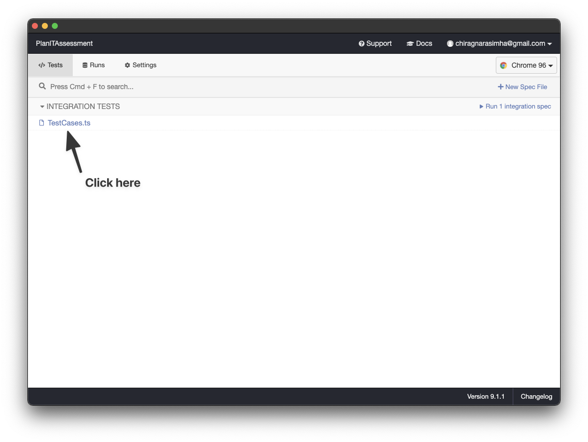
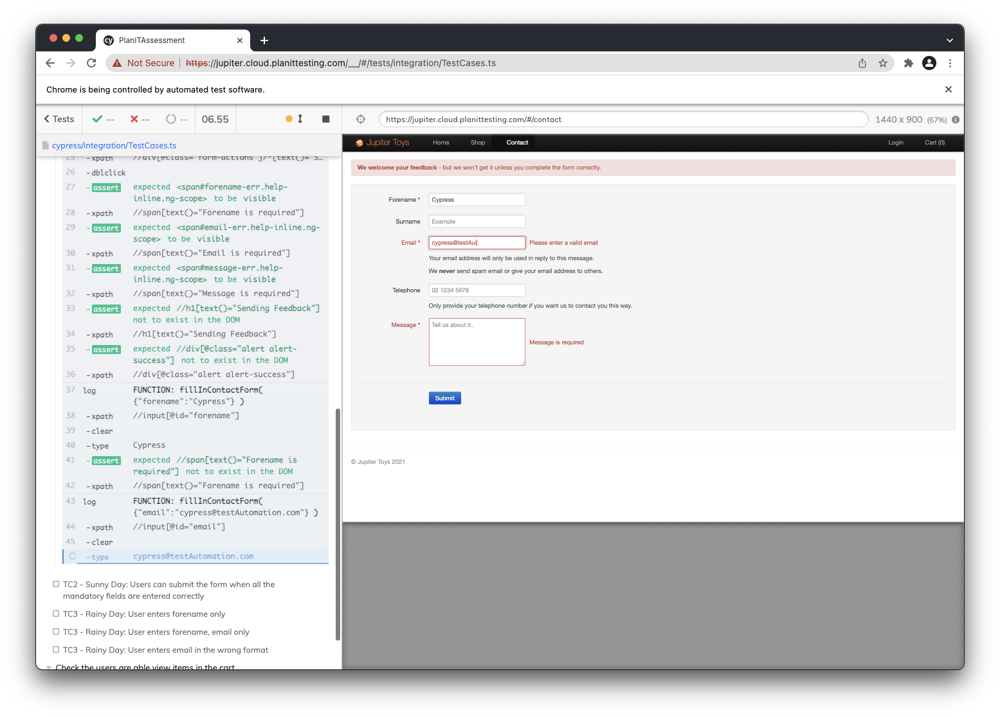

- [Introduction](#introduction)
- [Prereq](#prereq)
- [Getting Started](#getting-started)
- [Running the tests](#running-the-tests)
- [Failed Tests](#failed-tests)

# Introduction

This repo contains the solution to all the PlanIT Pre-interview test automation questions. The solutions to these questions are provided in the cypress test automation framework. To verify that these solutions are working, please install cypress

# Prereq

Please ensure that you have installed node on your computer. Although [Cypress website](https://docs.cypress.io/guides/getting-started/installing-cypress#System-requirements) says that it will work with versions of node that is 12 or 14 or above, it is recommended to install node v14.

# Getting Started

1. Clone the repo onto your local machine
2. Install all the node dependencies

   ```
   npm install
   ```
3. Run Cypress

   ```
   npm run cypress:open
   ```

# Running the tests

1. If all the dependencies were installed successfully, the cypress window will open

   
2. Cypress should then open the web browser and start running the tests

   

# Failed Tests
When running this repo, you will noticed that test case `TC3 - Rainy Day: User enters email in the wrong format` will fail. This is because of a bug within the application. If the email is in the wrong format, then the application should not be allowing the users to submit the form. 
